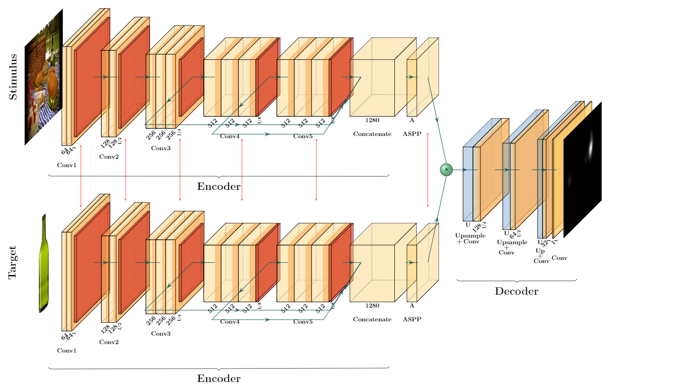
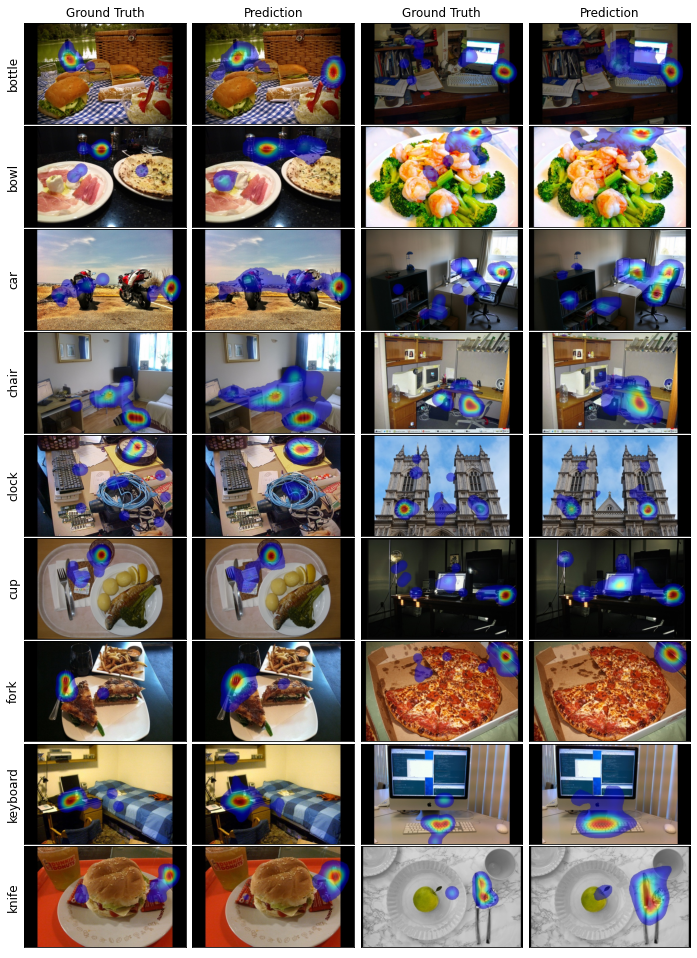

This repository contains the tensorflow implementation of paper **"Predicting visual attention and distraction during visual search using convolutional neural networks"** 

**_Abstract:_** *Most studies in computational modeling of visual attention are focused on task-free observation of images. However, free-viewing saliency considers very limited scenarios of humans’ behavior in daily life. Most visual activities that humans perform daily are goal-oriented and demand a great amount of top-down attention control. Visual Search is a simple task that requires observers to look for a target object in a scene. Compared to free-viewing saliency, visual search demands more top-down control of attention. In this paper, we present two approaches to model visual attention and distraction of observers during visual search. In the first approach, we adapt a light-weight free-viewing saliency model to predict fixation density maps of human observers, the probability of eye fixation over pixels of the search image, using a two-stream encoder-decoder network. This method helps us predict which locations are more distracting when searching for a particular target. We use COCO-Search18 dataset to train and evaluate our model. Our network achieves noticeable results on the state-of-the-art saliency metrics (AUC-Judd=0.95, AUC-Borji=0.85, sAUC=0.84, NSS=4.64, KLD=0.93, CC=0.72, SIM=0.54, and IG=2.59). Our second approach is object-based and predicts the segmentation of distractor and target objects during visual search. Distractors are all objects other than the target that the observers fixate on, during their search. This method uses a Mask-RCNN segmentation network pre-trained on Ms COCO and fine-tuned on COCO-Search18 dataset. Although the images of COCO-Search18 are taken from COCO dataset that provides segmentation annotations, these annotations often miss the targets and distractors fixated by observers in COCO-Search18. Therefore, we annotated images of COCO-Search18 for three target categories: bottle, bowl, and car. For each category, we train and evaluate a separate model. Considering the difficulty of the problem, we obtained relatively good average scores over the three categories (F1-score=0.64, MAP<sub>0.5</sub>=0.57, MAR<sub>0.5</sub>=0.73).*

# Method 1: Predicting where people fixate when searching for an object (Predicting Salience During Search)


## Architecture


Original repository forked from the implementation of MSI-Net saliency network [Contextual encoder-decoder network for visual saliency prediction](https://www.sciencedirect.com/science/article/pii/S0893608020301660) (2020), [original implementation](https://github.com/alexanderkroner/saliency)


## Citation

If you use the code of this repository, please do not forget to give us a star :innocent: and cite the following:

```
@article{Samiei2021visualsearch,
  title={Predicting visual attention and distraction during visual search using convolutional neural networks},
    journal = {Journal of Vision},
    volume = {},
    number = {},
    pages = {},
    year = {},
    month = {},
    issn = {},
    doi = {},
    url = {},
    eprint = {},
}
```

## Requirements

| Package    | Version |
|:----------:|:-------:|
| python     | 3.7.6   |
| tensorflow | 1.15.0  |
| matplotlib | 3.1.3   |
| numpy      | 1.18.1  |
| cv2        | 4.3.0   |
| pandas     | 1.0.1   |
| gdown      | 4.4.0   |
| wget       | 3.2     |
| pysaliency | -       |

All dependencies can be installed in a single docker image or an environment. 

## Scripts Summary

```dataset_download.py``` downloads COCO-Search18 dataset, target images, target bounding boxes, and VGG16 pretrained weights on ImageNet. <br/>
```data_preprocessing.py``` creates task-image pairs. Processes fixation data and creates Gaussian-blurred fixation maps. It resizes all images and fixation maps, augments data with horizontal flips, splits augmented data into train-test-validation sets. Unblurred fixation maps are also generated for test split to be used in saliency metrics computation. <br/>
```config.py``` contains the hyperparameters of training such as batch size and number of epochs. <br/>
```data.py ``` prepares and fetches the data to be efficiently used by gpu. It also handles the iteration over data during training and testing. <br/>
```model.py``` defines the model architecture, loads the pretrained weights, and performs the optimization and training operation. <br/>
```loss.py```  contains the KLD loss function, that is computed between the groundtruth and predicted saliecy maps. <br/>
```utils.py``` represents the training history of a model, keeps track of training and validation error, visualizes the training progress using a progress bar and prints the summary of training and validation loss. <br/>
```main.py``` defines the paths to data, results and weights, and handles the training and testing procedures by calling other scripts. <br/>
```compute_saliency_metrics.py``` computes the saliency metrics for each image of the test set by calling ```metrics.py``` script. It is possible to also use pysaliency library for measuring the metrics. However for consistency with the paper results, you should use ```metrics.py```. The average metric results (of ```metrics.py```) are written in a csv file. <br/>
```metrics.py``` contains the the implementation of all saliency metrics namely: AUC-Judd, AUC-Borji, sAUC, NSS, KLD, CC, SIM, and IG. 

## Running All Steps at Once

Run ```run_all.sh``` to run all steps including: 

1- downloading the dataset <br/>
2- data preprocessing <br/>
3- training <br/>
4- testing <br/>
5- computing saliency metrics 

You need to change the arguments related to each script accordingly. 
In the following, we explain each step in details. 

## Following a step by step guide

## Step 1: Dataset Download 

Run ```dataset_download.py``` as below:

```
    python dataset_download.py \
    --dldir=$DOWNLOAD_DIR 
```

```dldir```: is the directory path to save the downloaded dataset and weights. The default vlues is ```'../'```.  


## Step 2: Data Preprocessing

Run ```data_preprocessing.py```  as:

```
    python data_preprocessing.py \
    --dldir=$DOWNLOAD_DIR \
    --sigma=$SIGMA
```

```dldir``` is the directory path to save the downloaded dataset and weights. The default vlues is ```'../'```.   

```sigma``` determines the Gaussian blurring standard deviation. The default value of ```11``` is used. As in MIT saliency benchmark we set the cut-off frequency ```f_c``` as ```8```. Using  formula we derive a sigma of ```10.31``` and round it up to ```11```. 

## Step 3: Training 

To train the model on the dataset, run ```main.py``` as below:

```
    python main.py \
        --path=$DOWNLOAD_DIR \
        --phase=$PHASE \
        --threshold=$THRESHOLD
```
```path``` is the path to the downloaded dataset and weights. The default vlues is ```'../'```.   
```phase``` defines whether to train/test the model on the data.  The default vlues is ```'train'```.
```threshold``` defines the threshold for creating binary mask used during jet-color heatmap generation. The default vlues is ```30```.

## Step 3: Testing

To test the model on the dataset, we should change the ```phase``` to ```'test'``` and re-run ```main.py```:

```
    python main.py \
        --path=$DOWNLOAD_DIR \
        --phase=$PHASE \
        --threshold=$THRESHOLD
```
```path``` is the path to the downloaded dataset and weights. The default vlues is ```'../'```.   
```phase``` defines whether to train/test the model on the data.  The default vlues is ```'train'```.
```threshold``` defines the threshold for creating binary mask used during jet-color heatmap generation. The default vlues is ```30```.

## Step 4: Computing Saliency Metrics

To compute saliency metrics, run ```compute_saliency_metrics.py``` as:

```
    python compute_saliency_metrics.py \
        --path=$DOWNLOAD_DIR  \
        --use-pysaliency=$PYSAL \
        --csv-path=$CSV_DIR
```

```path``` is the path to the downloaded dataset and weights. The default vlues is ```'../'```.
```use-pysaliency``` is the flag that specifies whether to use pysaliency library to compute saliency metrics. The default vlues is ```False```.
```csv-path``` specifies the path to save the csv file containing computed saliency metrics. The default vlues is ```'../results/'```.

## Sample Results



