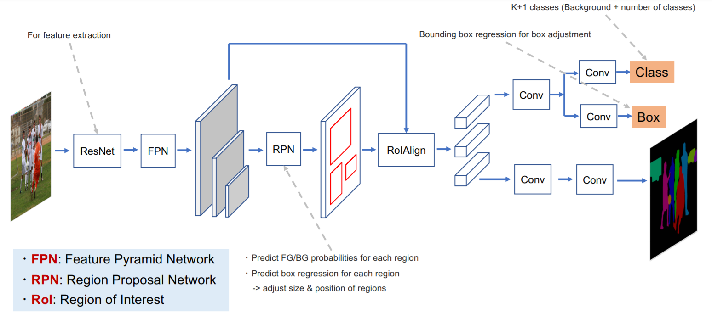

# Method 2: Predicting Segmentation of Targets and Distractors

**_summary note:_** *Our second approach is object-based and predicts the segmentation of distractor and target objects during visual search. Distractors are all objects other than the target that the observers fixate on, during their search. This method uses a Mask-RCNN segmentation network pre-trained on Ms COCO and fine-tuned on COCO-Search18 dataset. Although the images of COCO-Search18 are taken from COCO dataset that provides segmentation annotations, these annotations often miss the targets and distractors fixated by observers in COCO-Search18. Therefore, we annotated images of COCO-Search18 for three target categories: bottle, bowl, and car. For each category, we train and evaluate a separate model. Considering the difficulty of the problem, we obtained relatively good average scores over the three categories (F1-score=0.64, MAP<sub>0.5</sub>=0.57, MAR<sub>0.5</sub>=0.73).*


## Mask-RCNN Architecture 



[Image source](https://speakerdeck.com/nptdat/mask-rcnn-for-instance-segmentation) 

## Requirements

| Package    | Version | Package    | Version |
|:----------:|:-------:|:----------:|:-------:|
| python     |  3.7.6  | imgaug     | 0.4.0   |
| tensorflow |  1.15.3 | matplotlib | 3.1.3   |
| h5py       |  2.10.0 | numpy      | 1.18.1  |
| keras      |  2.1.6  | cv2        | 4.4.0   |
| gitpython  |  3.1.7  |scikit-image| 0.16.2  |
| alphashape |  1.3.1  | gdown      | 4.4.0   |
| shapely    |  1.8.2  | wget       | 3.2     |


## Scripts Summary

```download_data.py``` clones [MaskRCNN original repository](https://github.com/matterport/Mask_RCNN.git), downloads COCO-Search18 dataset, [our segmentation annotations](https://drive.google.com/uc?export=download&id=1ri6IToZzj9FUcXCK3PHXRhslXhwV4rHV), and target bounding boxes. <br/>

```data_preprocess.py``` reads images and fixation data of a specific target category, loads the annotation data for that category, counts how many observers have fixated on each distractor segmentation, creates masks for target and distractors (the mask value corresponds to how many observers have fixated on them i.e. their distraction level), and stores multi-channel masks as pickle files along with their search images. This file also creates distractor-target pair masks in ```distractor_target_pair``` just for the purpose visualization. <br/>

```main.py``` imports mask-rcnn implementation scripts from its original repository, downloads COCO trained weights, specifies configuration for training i.e. specifying the backbone architecture, image size, anchor scales, etc.,specifies configuration for inference, customize dataset scripts for our dataset and dvivides data into 5 folds of train-validation sets using 5-fold cross validation method, defines functions for storing and displaying inference results, specifies F1-score custom callback, iterates over each fold of cross-validation and trains and validates the model, saves model's inference results and stores recalls, precisions, MAP, MAR and f1-score for each fold. After iterating through all folds, calculates the final MAP, MAR and f1-score, and draws confusion matrix and PR-curve. All computed metrics are written in a csv file. <br/>

```confusion_matrix.py``` contains the code for computing true positive, false positive, true negative and false negative values, and plotting the confusion matrix for M-RCNN predictions. <br/>

## Running All Steps at Once

Run ```run.sh``` to run all steps including: 

1- downloading the dataset <br/>
2- data preprocessing <br/>
3- training, testing, saving inference results and computing metrics. <br/> 

You need to change the arguments related to each script accordingly. 
In the following, we explain each step in details. 

## Following a step by step guide

## Step 1: Dataset Download 

Run ```download_data.py``` as below:

```
    python download_data.py \
    --dldir=$DOWNLOAD_DIR 
```

```dldir```: is the directory path to save the downloaded dataset and clone the M-RCNN original repository. The default vlues is ```'../'```.  


## Step 2: Data Preprocessing

Run ```data_preprocess.py```  as:

```
    python data_preprocess.py \
    --dldir=$DOWNLOAD_DIR \
    --category=$CATEGORY \
    --classification=$CLASS
```

```dldir``` is the directory path to save the post-processed data (here created masks and search images). The default vlues is ```'../'```.   

```category``` specifies the target category that we are using to train M-RCNN model. The default value is ```'bottle'```.   

```classification``` defines the number of segmentation classes, i.e. whether we have 2 classes: distractor and target or 3 classes: low-distractor, high-distractor, and target. The default vlues is ```2```.   


## Step 3: Training and Evaluation

To train and evaluate the model on the dataset, run ```main.py``` as below:

```
    python main.py \
    --dldir=$DOWNLOAD_DIR \
    --classification=$CLASS  \
    --category=$CATEGORY \
    --outdir=$OUTDIR
```
```dldir``` is the directory path to save the post-processed data (here created masks and search images). The default vlues is ```'../'```.   

```category``` specifies the target category that we are using to train M-RCNN model. The default value is ```'bottle'```.   

```classification``` defines the number of segmentation classes, i.e. whether we have 2 classes: distractor and target or 3 classes: low-distractor, high-distractor, and target. The default vlues is ```2```.

```outdir``` specifies the directory to store the inference results on validation data along with their ground truth, the confusion matrix, the pr-curve, the saved checkpoints of the model, and logs to tensorboard. The default vlues is ```'../results/'```.

## Sample Results

<!--  -->
